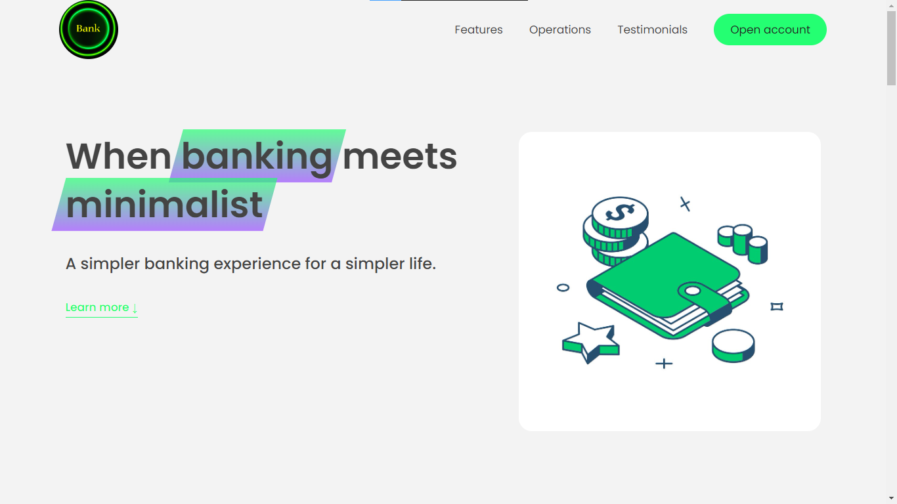

# Udemy Udemy-Complete_JavaScript_Course

Customized and reimplemented by 

## Welcome! 👋

Thanks for checking out this coding practice.

From this  One of the best courses to learn JS!

**To do this project , you need a good understanding of HTML, CSS, JS**

# The Bankist commercial labning page

Related to previous Bankist project, can find the bankist app here ->
Bacnkist Account manger app 

# TOPICS COVERED: 

- Advanced DOM manipulation and Events {

    Working with DOM tree in a more advanced way. How Document Object Model works, how JS uses it to interact with browsers, etc.

    Page contains four main sections each of which are somehow interactive using JS, including :
    - lazy loading images
    - scrolling events using Intersection Observer API
    - A changable tabbed component table
    - A slider

}

# Website is exactly as designed by the author, but the code and functions are all rewrited and implemented by me. Special thanks to the master Jonas for these hands-on and informative projects.

**Have fun building!** 👩‍💻👩‍💻👩‍💻👩‍💻👩‍💻👩‍💻 
